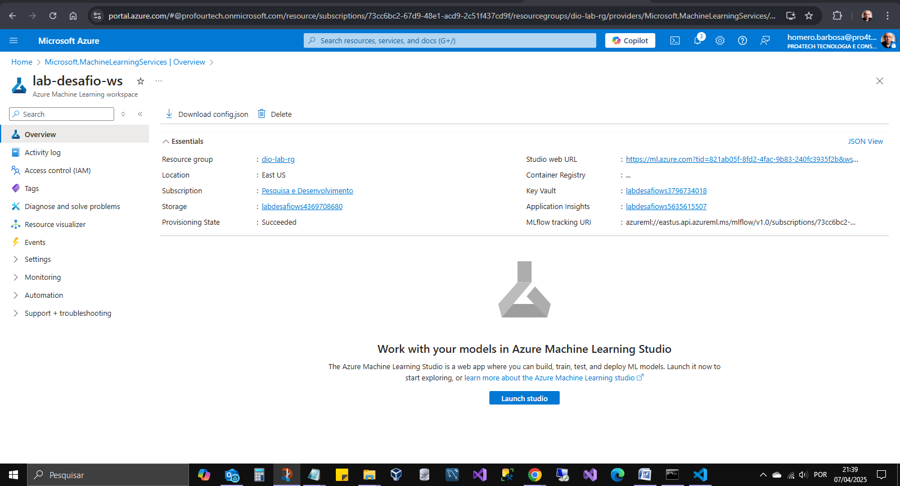
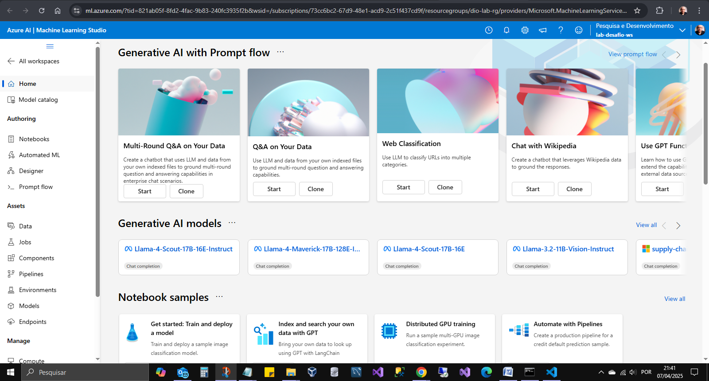
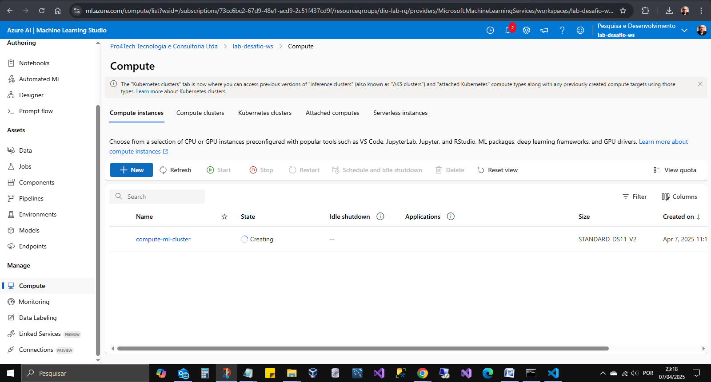
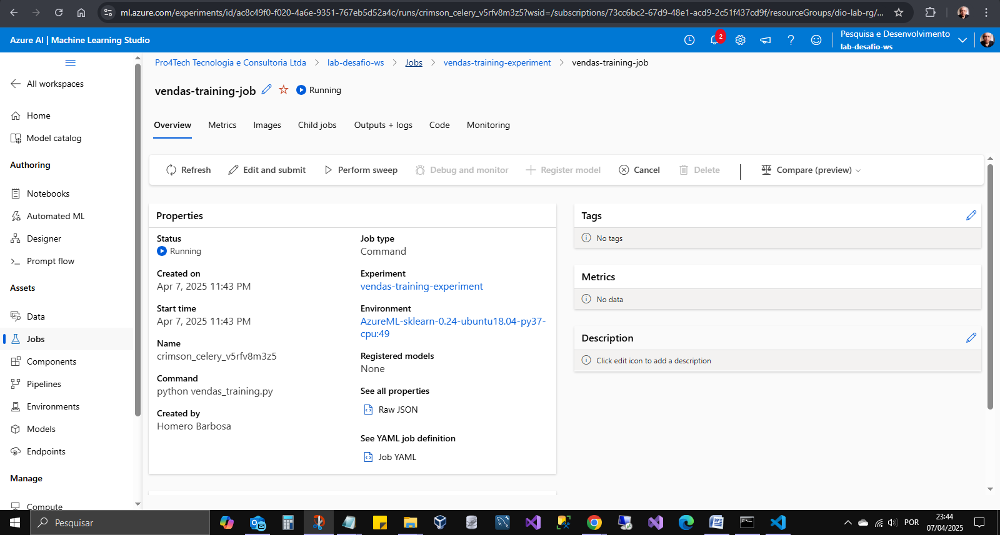

# Azure Machine Learning - Prever Vendas

Objetivo implantar e treinar modelo de Regressão Linear para prever vendas.

## Estrutura do Projeto
.
│   .gitignore
│   gerar_amostras.py
│   script_ml.py
│   README.md
│   requirements.txt
│   compute-creating.png
│   job-running.png
│   ml-azure-com.png
│   workspace.png
│   LICENSE
│
└───sorvetes_ml
    │   script_ml.ipynb
    │
    └───inputs
            historico.csv

## Gerador de amostras

- Incluido: gerar_amostras.py

## Arquivo Python Base

- Script Python para gerar o arquivo .ipynb células do Jupyter

## Criar arquivo .ipynb : jupytext

```
pip install jupytext
jupytext --to notebook .\script_ml.py
```

## Implantações

- workspace
  
- ml.azure.com
  
- compute-creating
  
- job-running
  

